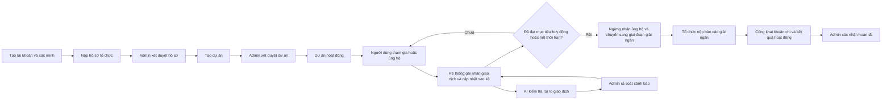

# Tóm tắt hệ thống: Mục tiêu, quy trình nghiệp vụ Web và AI

## 1) Hệ thống này phục vụ mục đích gì?

Hệ thống được xây dựng để giải quyết bài toán minh bạch trong hoạt động cộng đồng:

- Giúp tổ chức cộng đồng tạo và vận hành dự án thiện nguyện một cách có kiểm soát.
- Giúp người ủng hộ theo dõi được dòng tiền đóng góp và kết quả sử dụng tiền.
- Giảm rủi ro gian lận nhờ cơ chế phát hiện sớm bằng AI và bước xác minh của quản trị viên.

Nói đơn giản: hệ thống đảm bảo “gây quỹ đúng – dùng tiền đúng – công khai rõ ràng”.

## 2) Các vai trò chính trong hệ thống

- **Người tham gia/ủng hộ (Volunteer):** xem dự án, tham gia hoạt động, ủng hộ tài chính, gửi phản ánh.
- **Người quản lý tổ chức (Manager):** tạo dự án, cập nhật tiến độ, quản lý hoạt động dự án, nộp báo cáo giải ngân.
- **Quản trị viên (Admin):** kiểm tra tính hợp lệ của tổ chức và dự án, rà soát cảnh báo rủi ro, xác nhận kết quả cuối cùng.

## 3) Luồng nghiệp vụ tổng thể

## 4) Diễn giải chi tiết luồng Web (dễ hiểu, không cần nền tảng kỹ thuật)

## 4.1 Tạo tài khoản và phân vai trò

Người dùng cần tạo tài khoản và xác minh email trước khi thực hiện các nghiệp vụ quan trọng.
Sau khi đăng nhập, quyền thao tác của mỗi người phụ thuộc vào vai trò:

- Người ủng hộ: thực hiện đóng góp, theo dõi sao kê, gửi phản ánh.
- Người quản lý tổ chức: vận hành dự án, đăng cập nhật và nộp báo cáo giải ngân.
- Quản trị viên: kiểm tra, duyệt và giám sát rủi ro.

Ý nghĩa:

- Mọi hành động đều gắn với một tài khoản cụ thể, thuận lợi cho việc kiểm tra và truy vết.

## 4.2 Duyệt tổ chức trước khi cho hoạt động

Tổ chức phải nộp hồ sơ pháp lý và thông tin nhận tiền.
Quản trị viên kiểm tra hồ sơ:

- Nếu đạt yêu cầu: cho phép tổ chức hoạt động.
- Nếu chưa đạt: yêu cầu bổ sung hoặc từ chối.

Ý nghĩa:

- Chỉ tổ chức hợp lệ mới có thể kêu gọi đóng góp.

## 4.3 Tạo dự án và công khai lịch sử chỉnh sửa

Sau khi tổ chức hợp lệ, người quản lý tạo dự án và gửi duyệt.
Dự án chỉ được mở công khai khi đã qua bước kiểm tra.

**Bổ sung quan trọng (theo yêu cầu):**

- **Lịch sử chỉnh sửa dự án là công khai.**
- Mọi người dùng đều xem được nội dung đã thay đổi, thời điểm thay đổi và ai thay đổi.

Ý nghĩa:

- Tăng tính minh bạch và tránh thay đổi nội dung dự án một cách khó kiểm soát.

## 4.4 Đóng góp và điều kiện tự động ngừng nhận đóng góp

Khi dự án đang hoạt động, người dùng có thể ủng hộ.
Hệ thống ghi nhận giao dịch từ phía ngân hàng và cập nhật lên sao kê.

**Bổ sung quan trọng (theo yêu cầu):**

Hệ thống sẽ **tự động ngừng nhận đóng góp** trong 2 trường hợp:

1. **Tổng tiền đã đạt ngưỡng huy động** mà dự án đặt ra.
2. **Hết thời hạn kêu gọi** theo kế hoạch dự án.

Khi một trong hai điều kiện xảy ra:

- Dự án chuyển sang giai đoạn “không nhận thêm đóng góp”.
- Người dùng vẫn xem được sao kê và thông tin tổng kết, nhưng không thể tạo giao dịch ủng hộ mới cho dự án đó.

Ý nghĩa:

- Đảm bảo đúng cam kết huy động và tránh nhận tiền vượt phạm vi đã công bố.

## 4.5 Mỗi giao dịch được định danh riêng cho một người dùng như thế nào?

**Bổ sung quan trọng (theo yêu cầu):**

Để mỗi giao dịch gắn được với đúng người ủng hộ, hệ thống thực hiện theo quy trình sau:

1. Khi người dùng bấm ủng hộ, hệ thống tạo một **phiên quyên góp riêng** cho người đó.
2. Phiên này có một **mã định danh riêng** (mã phiên) và thời hạn hiệu lực.
3. Mã phiên được nhúng vào thông tin thanh toán (nội dung chuyển khoản/QR).
4. Khi ngân hàng gửi xác nhận giao dịch, hệ thống đọc mã phiên để đối chiếu.
5. Nếu khớp, giao dịch sẽ được gán đúng vào tài khoản người dùng đã tạo phiên quyên góp đó.

Kết quả:

- Mỗi giao dịch có thể truy ngược về người thực hiện.
- Hạn chế tình trạng giao dịch “không rõ nguồn gốc”.
- Tăng độ chính xác cho sao kê và phân tích rủi ro.

## 4.6 Nộp báo cáo giải ngân và công khai kết quả khi dự án kết thúc

**Bổ sung quan trọng (theo yêu cầu):**

Khi dự án kết thúc huy động, tổ chức bắt buộc nộp báo cáo giải ngân.
Báo cáo này cần thể hiện rõ:

- Các khoản chi đã thực hiện.
- Mục đích từng khoản chi.
- Chứng từ hoặc bằng chứng liên quan.
- Kết quả hoạt động sau khi sử dụng nguồn tiền.

Sau khi quản trị viên xác nhận:

- Báo cáo được công khai để cộng đồng theo dõi.
- Dự án chuyển sang trạng thái hoàn tất.

Ý nghĩa:

- Không chỉ minh bạch “đã nhận bao nhiêu”, mà còn minh bạch “đã dùng vào việc gì và tạo kết quả gì”.

## 5) Nghiệp vụ AI: giải thích đơn giản cho người không chuyên

## 5.1 AI trong hệ thống làm gì?

AI không thay thế quyết định của con người.
AI chỉ có nhiệm vụ **phát hiện sớm giao dịch có dấu hiệu rủi ro** để quản trị viên ưu tiên kiểm tra.

## 5.2 AI 2 tầng là gì?

Hệ thống dùng hai lớp kiểm tra:

### Tầng 1: Phát hiện “khác thường”

- Tầng này học hành vi giao dịch thông thường trong hệ thống.
- Khi gặp một giao dịch có đặc điểm lệch mạnh so với mẫu thường gặp, tầng này đánh dấu đó là bất thường.

Mục tiêu:

- Bắt các mẫu lạ mới xuất hiện, kể cả khi chưa có lịch sử gian lận rõ ràng.

### Tầng 2: Dự đoán khả năng rủi ro

- Tầng này học từ các trường hợp đã được quản trị viên kết luận trước đó.
- Dựa vào kinh nghiệm quá khứ, tầng này ước lượng mức độ rủi ro của giao dịch mới.

Mục tiêu:

- Tăng độ chính xác dựa trên dữ liệu thực tế đã được xác nhận.

## 5.3 Hai tầng phối hợp ra sao?

- Tầng 1 giúp phát hiện điều lạ.
- Tầng 2 giúp đánh giá mức độ rủi ro dựa trên kinh nghiệm đã có.
- Kết quả cuối là một danh sách giao dịch cần quản trị viên kiểm tra.

Lưu ý quan trọng:

- AI chỉ cảnh báo.
- Quản trị viên mới là người đưa ra kết luận cuối cùng.

## 6) Khi nào một giao dịch được xem là bất thường?

Một giao dịch được đưa vào diện cần rà soát khi có một hoặc nhiều dấu hiệu sau:

- Giá trị giao dịch tăng đột biến so với lịch sử đóng góp trước đó.
- Nhiều giao dịch lặp lại với tần suất bất thường trong thời gian ngắn.
- Dòng giao dịch xuất hiện theo mẫu giống nhau giữa nhiều tài khoản.
- Thông tin đối soát giao dịch không khớp với phiên quyên góp đã tạo.

Lưu ý:

- “Bất thường” không có nghĩa chắc chắn là gian lận.
- Đây là tín hiệu để kiểm tra kỹ hơn, không phải kết luận cuối cùng.

## 7) Chỉ số nên theo dõi khi vận hành

- Tỷ lệ tổ chức được duyệt.
- Tỷ lệ dự án được duyệt.
- Tỷ lệ giao dịch ghi nhận thành công.
- Tỷ lệ dự án hoàn tất báo cáo giải ngân đúng hạn.
- Tỷ lệ cảnh báo AI được xác nhận là rủi ro thực.

## 8) Kết luận ngắn

Hệ thống giúp vận hành dự án cộng đồng theo vòng đời rõ ràng, minh bạch dòng tiền và có lớp giám sát rủi ro chủ động.
Luồng Web đảm bảo tính công khai và trách nhiệm; luồng AI hỗ trợ phát hiện sớm để con người ra quyết định chính xác hơn.
