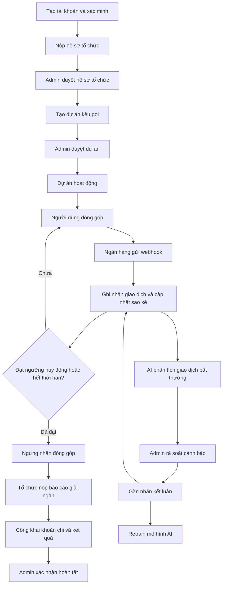

# HỆ THỐNG KẾT NỐI TÌNH NGUYỆN VIÊN VỚI DỰ ÁN CỘNG ĐỒNG – TÍCH HỢP AI PHÁT HIỆN GIAO DỊCH QUYÊN GÓP BẤT THƯỜNG

## 1. Tổng quan

Hệ thống hỗ trợ tổ chức cộng đồng vận hành dự án gây quỹ theo hướng:

- Minh bạch dòng tiền
- Công khai tiến trình dự án
- Kiểm soát rủi ro giao dịch bằng AI kết hợp kiểm duyệt thủ công

Vai trò chính:

- **Volunteer**: xem dự án, đăng ký tham gia dự án, đóng góp, gửi phản ánh.
- **Manager**: tạo và vận hành dự án, cập nhật tiến độ, nộp báo cáo giải ngân.
- **Admin**: duyệt hồ sơ tổ chức/dự án, rà soát cảnh báo rủi ro, xác nhận kết luận cuối.

## 2. Luồng nghiệp vụ tổng thể

## 3. Nghiệp vụ Web chi tiết

## 3.1 Đăng ký, xác minh, phân quyền

- Người dùng cần xác minh email để thực hiện nghiệp vụ quan trọng.
- Mỗi thao tác được gắn với danh tính cụ thể theo vai trò Volunteer/Manager/Admin.

## 3.2 Duyệt tổ chức và duyệt dự án

- Tổ chức nộp hồ sơ pháp lý + thông tin nhận tiền
- Admin duyệt hồ sơ trước khi cho phép tạo dự án
- Dự án chỉ hoạt động công khai sau khi qua bước duyệt dự án

## 3.3 Công khai lịch sử chỉnh sửa dự án

Lịch sử chỉnh sửa dự án được công khai cho mọi người dùng, gồm:

- Thời điểm chỉnh sửa
- Nội dung trước/sau chỉnh sửa
- Người thực hiện chỉnh sửa
- Lý do chỉnh sửa (nếu có)

Mục đích: tránh thay đổi âm thầm và tăng tính minh bạch.

## 3.4 Cơ chế ngừng nhận đóng góp tự động

Hệ thống tự động dừng đóng góp khi xảy ra một trong hai điều kiện:

1. Tổng tiền đã đạt ngưỡng huy động của dự án
2. Dự án hết thời hạn kêu gọi

Sau khi dừng:

- Không nhận thêm giao dịch mới
- Sao kê vẫn công khai
- Dự án chuyển sang giai đoạn giải ngân

## 3.5 Định danh mỗi giao dịch theo từng người dùng

Mỗi giao dịch được gắn với một người dùng qua cơ chế phiên đóng góp:

1. Người dùng bấm đóng góp -> hệ thống tạo phiên đóng góp riêng (mã phiên + thời hạn).
2. Mã phiên được gắn vào thông tin thanh toán (QR/nội dung chuyển khoản).
3. Ngân hàng gửi webhook -> hệ thống đọc mã phiên và đối chiếu.
4. Nếu khớp, giao dịch được gán đúng vào tài khoản đã tạo phiên.

Kết quả:

- Truy ngược được giao dịch về đúng người đóng góp
- Giảm giao dịch không rõ nguồn gốc
- Tăng độ chính xác sao kê và phân tích rủi ro

## 3.6 Báo cáo giải ngân và công khai kết quả dự án

Khi kết thúc huy động, tổ chức phải nộp báo cáo giải ngân.
Nội dung công khai tối thiểu:

- Danh sách khoản chi
- Mục đích chi
- Chứng từ liên quan
- Kết quả hoạt động sau giải ngân

Sau khi Admin xác nhận, dự án chuyển trạng thái hoàn tất và báo cáo được công khai.

## 4. Luồng xử lý webhook:

1. Ngân hàng gửi callback giao dịch về endpoint webhook.
2. Hệ thống kiểm tra chữ ký số/HMAC để xác thực nguồn gửi.
3. Kiểm tra chống xử lý trùng bằng idempotency key (`bank_reference`/`event_id`).
4. Đối soát mã phiên đóng góp để gán giao dịch cho đúng người dùng.
5. Lưu giao dịch và đẩy sang bước đánh giá rủi ro AI.
6. Cập nhật sao kê công khai theo thời gian thực.

Nguyên tắc bắt buộc:

- Webhook phải được xử lý idempotent (gửi lại nhiều lần vẫn không ghi trùng)
- Chỉ chấp nhận payload hợp lệ đã qua xác thực chữ ký
- Lưu đầy đủ log để phục vụ truy vết và đối soát

## 5. Nghiệp vụ AI

## 5.1 Vai trò AI

AI có nhiệm vụ phát hiện sớm giao dịch rủi ro và ưu tiên danh sách kiểm tra cho Admin.
AI không thay thế kết luận của con người.

## 5.2 Mô hình AI 2 tầng

### Tầng 1 — Isolation Forest (không nhãn)

- Học mẫu giao dịch bình thường để phát hiện điểm lệch
- Đầu vào: feature snapshot tại thời điểm giao dịch
- Đầu ra: điểm bất thường.

### Tầng 2 — Fraud Classifier (có nhãn)

- Học từ dữ liệu đã được Admin kết luận
- Đầu vào: feature snapshot + nhãn lịch sử
- Đầu ra: xác suất rủi ro

### Hợp nhất kết quả

- Kết hợp điểm của 2 tầng để tạo mức cảnh báo cuối
- Giao dịch vượt ngưỡng vào hàng đợi rà soát của Admin

## 6. Khi nào giao dịch được coi là bất thường?

### Nhóm 1: Bất thường về giá trị giao dịch  
*(Behavioral Amount Anomaly)*

- Giá trị giao dịch khác biệt đáng kể so với hành vi donate thông thường trước đây của người dùng.

Ví dụ:
- Trước đây thường donate số tiền nhỏ và ổn định nhưng đột nhiên phát sinh giao dịch có giá trị cao bất thường.

---

### Nhóm 2: Bất thường về tần suất và thời điểm giao dịch  
*(Velocity & Time-based Anomaly)*

- Một người dùng thực hiện quá nhiều giao dịch trong khoảng thời gian ngắn.
- Giao dịch phát sinh vào khung giờ hiếm gặp hoặc khác đáng kể so với hành vi donate thông thường.

Ví dụ:
- Spam nhiều giao dịch liên tiếp trong vài phút
- Donate liên tục vào khung giờ khuya hoặc rạng sáng.

---

### Nhóm 3: Bất thường theo pattern phối hợp  
*(Coordinated Transaction Pattern)*

- Nhiều giao dịch có cùng mức tiền xuất hiện liên tục trong thời gian ngắn.
- Nhiều user khác nhau cùng thực hiện giao dịch với số tiền giống hệt nhau trong cùng khoảng thời gian.

Ví dụ:
- Nhiều tài khoản khác nhau cùng donate một mức tiền lặp lại theo cụm thời gian ngắn.

---

### Nhóm 4: Bất thường về IP và thiết bị  
*(IP & Device Behavior Anomaly)*

- Một người dùng sử dụng nhiều IP khác nhau trong thời gian ngắn.
- Một người dùng thay đổi thiết bị liên tục trong khoảng thời gian ngắn.

Ví dụ:
- Cùng tài khoản nhưng phát sinh giao dịch từ nhiều IP hoặc nhiều thiết bị khác nhau trong thời gian ngắn.