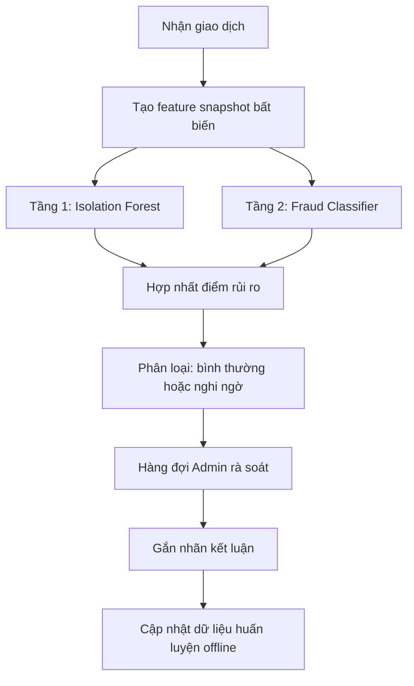

# Tóm tắt hệ thống: Luồng nghiệp vụ Web và AI

## 1) Mục đích hệ thống

Hệ thống được xây dựng để phục vụ 3 mục tiêu chính:

- Kết nối tổ chức cộng đồng với người tham gia và người ủng hộ.
- Đảm bảo minh bạch dòng tiền từ lúc nhận đóng góp đến lúc giải ngân.
- Giảm rủi ro gian lận bằng cơ chế AI phát hiện sớm và kiểm duyệt bởi quản trị viên.

## 2) Vai trò người dùng

- **Người tham gia/ủng hộ (Volunteer):** xem dự án, tham gia hoạt động, ủng hộ tài chính, gửi phản ánh.
- **Người quản lý tổ chức (Manager):** tạo và vận hành dự án, cập nhật tiến độ, nộp báo cáo giải ngân.
- **Quản trị viên (Admin):** duyệt hồ sơ tổ chức, duyệt dự án, xử lý giao dịch bất thường, kiểm soát tuân thủ.

## 3) Luồng nghiệp vụ tổng thể

```mermaid
flowchart LR
  A[Tạo tài khoản và xác minh] --> B[Tổ chức nộp hồ sơ]
  B --> C[Admin xét duyệt hồ sơ]
  C --> D[Tạo dự án]
  D --> E[Admin xét duyệt dự án]
  E --> F[Dự án hoạt động]
  F --> G[Người dùng tham gia hoặc ủng hộ]
  G --> H[Sao kê công khai]
  H --> I[Nộp báo cáo giải ngân]
  I --> J[Admin xác nhận kết quả]

  G --> K[AI phát hiện giao dịch bất thường]
  K --> L[Admin rà soát cảnh báo]
  L --> H
```

Diễn giải ngắn:

- Luồng web đảm bảo vận hành dự án từ đầu đến cuối theo quy trình rõ ràng.
- Luồng AI chạy song song với nghiệp vụ quyên góp để cảnh báo rủi ro sớm.
- Quyết định cuối cùng luôn có bước xác minh của Admin.

## 4) Luồng nghiệp vụ Web cốt lõi

## 4.1 Xác thực và phân quyền

- Người dùng đăng ký và xác minh email trước khi sử dụng nghiệp vụ chính.
- Quyền thao tác được tách theo vai trò (Volunteer, Manager, Admin).

Mục đích:

- Đảm bảo mọi hành động đều gắn với danh tính rõ ràng để truy vết.

## 4.2 Onboarding tổ chức

- Tổ chức nộp hồ sơ pháp lý và thông tin tài khoản nhận tiền.
- Admin kiểm tra hồ sơ và đưa ra kết quả duyệt hoặc từ chối.
- Hồ sơ quá hạn xử lý được chuyển trạng thái hết hạn nhưng vẫn lưu để phục vụ kiểm tra sau này.

Mục đích:

- Chỉ tổ chức hợp lệ mới có thể tạo và vận hành dự án.

## 4.3 Vòng đời dự án

Các trạng thái vận hành chính:

`DRAFT -> PENDING_REVIEW -> APPROVED -> ACTIVE -> DISBURSEMENT_DUE -> COMPLETED`

Trạng thái kiểm soát:

- `REJECTED` khi không đạt yêu cầu duyệt.
- `SUSPENDED` khi cần dừng khẩn cấp để kiểm soát rủi ro.

Mục đích:

- Đảm bảo mọi dự án đều đi qua bước kiểm tra trước khi mở công khai.

## 4.4 Quyên góp và ghi nhận giao dịch

Luồng chính:

1. Người dùng tạo phiên quyên góp có thời hạn.
2. Hệ thống tạo QR để thanh toán.
3. Ngân hàng gửi webhook giao dịch về hệ thống.
4. Hệ thống kiểm tra tính hợp lệ chữ ký và chống gửi lại bản tin trùng.
5. Hệ thống đối soát giao dịch với phiên quyên góp.
6. Giao dịch hợp lệ được ghi nhận và chuyển sang bước kiểm tra rủi ro AI.

Mục đích:

- Ghi nhận đúng, không ghi trùng, có thể kiểm tra nguồn gốc từng giao dịch.

## 4.5 Sao kê công khai

- Giao dịch bình thường và giao dịch cần theo dõi vẫn được hiển thị công khai (có cảnh báo).
- Giao dịch đã kết luận gian lận hoặc bị đảo ngược sẽ bị ẩn khỏi sao kê công khai.
- Manager/Admin có thể xuất sao kê để phục vụ đối chiếu.

Mục đích:

- Minh bạch thông tin tài chính với cộng đồng.

## 4.6 Giải ngân và đóng dự án

1. Khi kết thúc giai đoạn nhận tiền, tổ chức phải nộp báo cáo sử dụng tiền.
2. Admin kiểm tra chứng từ và kết luận.
3. Khi báo cáo hợp lệ, dự án được hoàn tất và có bản tổng kết công khai.

Mục đích:

- Đóng vòng minh bạch: nhận tiền -> sử dụng tiền -> công khai kết quả.

## 5) Nghiệp vụ AI: Mô hình 2 tầng

## 5.1 Mục tiêu AI

- Phát hiện sớm giao dịch bất thường để giảm thất thoát.
- Hỗ trợ Admin ưu tiên kiểm tra đúng điểm rủi ro.

## 5.2 Kiến trúc AI 2 tầng

## 5.3 Cách huấn luyện từng tầng

### Tầng 1 — Isolation Forest (Unsupervised)

Bản chất:

- Học mẫu hành vi giao dịch “khác thường” mà **không cần nhãn gian lận**.

Dữ liệu train:

- Dùng feature snapshot bất biến tại thời điểm giao dịch.
- Không sử dụng nhãn do Admin gắn để tránh rò rỉ nhãn vào tầng 1.

Đầu ra:

- Điểm bất thường (anomaly score) cho từng giao dịch.

Mục đích tầng 1:

- Bắt các mẫu lạ mới phát sinh, kể cả khi chưa có đủ lịch sử nhãn.

### Tầng 2 — Fraud Classifier (Supervised)

Bản chất:

- Học từ dữ liệu đã có nhãn kết luận để dự đoán xác suất gian lận.

Dữ liệu train:

- Feature snapshot + nhãn kết luận từ quy trình rà soát của Admin.
- Dùng dữ liệu lịch sử đã làm sạch và có kiểm soát chất lượng nhãn.

Đầu ra:

- Xác suất giao dịch có rủi ro gian lận.

Mục đích tầng 2:

- Tăng độ chính xác dựa trên kinh nghiệm xử lý thực tế đã tích lũy.

## 5.4 Cơ chế kết hợp 2 tầng

- Hệ thống kết hợp điểm của tầng 1 và tầng 2 để đưa ra mức rủi ro cuối.
- Giao dịch vượt ngưỡng cảnh báo sẽ vào hàng đợi cho Admin kiểm tra.
- AI chỉ cảnh báo; kết luận cuối cùng vẫn do con người phê duyệt.

Ý nghĩa:

- Vừa phát hiện được mẫu lạ mới, vừa tận dụng kiến thức lịch sử đã gắn nhãn.

## 5.5 Giao dịch như thế nào được coi là bất thường?

Trong ngữ cảnh hệ thống này, một giao dịch được xem là **bất thường** khi có một hoặc nhiều dấu hiệu sau:

### Nhóm 1: Bất thường về số tiền và nhịp giao dịch

- Số tiền cao đột biến so với lịch sử đóng góp thông thường của cùng dự án.
- Nhiều giao dịch nhỏ lặp lại trong thời gian rất ngắn từ cùng nguồn (mẫu “chia nhỏ giao dịch”).
- Giao dịch tăng đột ngột theo cụm thời gian bất thường (ví dụ dồn vào khung giờ hiếm khi có đóng góp).

### Nhóm 2: Bất thường về nội dung và đối soát

- Nội dung chuyển khoản không khớp hoặc không chứa mã phiên quyên góp.
- Giao dịch không đối soát được với phiên quyên góp hợp lệ.
- Chênh lệch đáng kể giữa số tiền kỳ vọng và số tiền thực nhận.

### Nhóm 3: Bất thường về danh tính và hành vi nguồn gửi

- Nhiều giao dịch từ các tài khoản có mẫu thông tin rất giống nhau trong thời gian ngắn.
- Dấu hiệu một nhóm tài khoản phối hợp để tạo “dòng tiền giả” cho cùng dự án.
- Lịch sử đóng góp của nguồn gửi thay đổi đột ngột, trái ngược hoàn toàn hành vi trước đó.

### Nhóm 4: Bất thường theo bối cảnh dự án

- Dự án gần kết thúc nhưng phát sinh đột biến giao dịch không tương xứng truyền thông/thực tế.
- Dự án đang bị theo dõi rủi ro nhưng vẫn có luồng giao dịch tăng mạnh bất thường.
- Giao dịch phát sinh trong thời điểm hoặc điều kiện ít hợp lý theo đặc thù dự án.

### Lưu ý quan trọng

- “Bất thường” không đồng nghĩa ngay với “gian lận”.
- AI chỉ đưa giao dịch vào diện cần rà soát.
- Kết luận cuối cùng vẫn do Admin xác minh thủ công dựa trên chứng cứ.