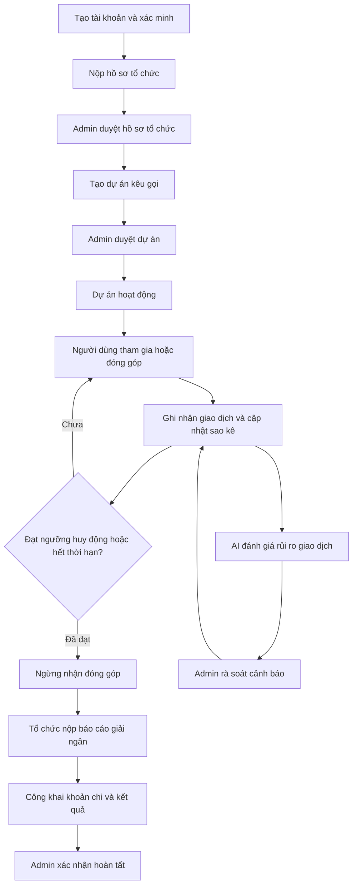

# HỆ THỐNG KẾT NỐI TÌNH NGUYỆN VIÊN VỚI DỰ ÁN CỘNG ĐỒNG – TÍCH HỢP AI PHÁT HIỆN GIAO DỊCH QUYÊN GÓP BẤT THƯỜNG

## 1. Tổng quan hệ thống

Hệ thống này phục vụ bài toán gây quỹ cộng đồng theo hướng minh bạch và kiểm soát rủi ro.

- Kết nối tổ chức cộng đồng với người tham gia và người ủng hộ.
- Công khai dòng tiền từ lúc nhận đóng góp đến lúc sử dụng.

- Phát hiện sớm giao dịch đáng ngờ để giảm rủi ro gian lận.

## 2. Vai trò trong hệ thống

- **Volunteer (người tham gia/ủng hộ):** xem dự án, tham gia hoạt động, thực hiện đóng góp, gửi phản ánh.
- **Manager (người quản lý tổ chức):** tạo dự án, cập nhật tiến độ, nộp báo cáo giải ngân.

- **Admin (quản trị viên):** duyệt hồ sơ tổ chức, duyệt dự án, rà soát cảnh báo AI, xác nhận kết luận cuối cùng.

## 3. Luồng nghiệp vụ tổng thể

## 4. Phân rã chức năng

## 4.1 Tạo tài khoản và xác minh

Người dùng cần đăng ký và xác minh email trước khi sử dụng hệ thống quan trọng.

- Mọi thao tác đều gắn với một danh tính cụ thể.
- Hạn chế hành vi ẩn danh trong quyên góp và quản trị dự án.

- Người dùng chưa đăng ký (guest) chỉ được phép truy cập và xem thông tin công khai của dự án, không thể thực hiện các chức năng như quyên góp, tạo dự án hoặc tương tác với hệ thống.

## 4.2 Duyệt hồ sơ tổ chức

Tổ chức nộp hồ sơ pháp lý và thông tin tài khoản nhận tiền.
Admin kiểm tra và ra quyết định:

- Hồ sơ đạt yêu cầu -> cho phép tổ chức hoạt động.
- Hồ sơ chưa đạt -> yêu cầu bổ sung hoặc từ chối.

- Chỉ tổ chức hợp lệ mới được phép kêu gọi đóng góp.

## 4.3 Tạo dự án và công khai lịch sử chỉnh sửa

Sau khi tổ chức hợp lệ, Manager tạo dự án và gửi duyệt.
Dự án chỉ mở công khai sau khi qua bước kiểm tra.

Lịch sử chỉnh sửa dự án được công khai cho tất cả người dùng, gồm:

- Thời điểm thay đổi.
- Nội dung trước và sau khi chỉnh sửa.
- Người thực hiện thay đổi.
- Lý do thay đổi (nếu có).
- Tránh thay đổi thông tin dự án một cách âm thầm.

- Tăng niềm tin vì cộng đồng có thể theo dõi toàn bộ quá trình cập nhật.

## 4.4 Đóng góp và cơ chế tự động ngừng nhận đóng góp

Khi dự án hoạt động, người dùng có thể đóng góp qua luồng thanh toán.
Mỗi giao dịch được cập nhật vào sao kê sau khi hệ thống nhận xác nhận từ ngân hàng.

Hệ thống tự động ngừng nhận đóng góp khi xảy ra một trong hai điều kiện:

1. Tổng tiền đã đạt ngưỡng huy động mà dự án đặt ra.
2. Dự án đã hết thời hạn kêu gọi.

Sau khi ngừng đóng góp:

- Dự án không nhận thêm giao dịch mới.
- Sao kê và thông tin dự án vẫn được xem công khai.
- Dự án chuyển sang giai đoạn báo cáo giải ngân.

- Đảm bảo đúng cam kết huy động và tránh nhận tiền vượt kế hoạch.

## 4.5 Định danh giao dịch theo người dùng

Để mỗi giao dịch gắn đúng người ủng hộ, hệ thống dùng cơ chế “phiên đóng góp”:

1. Khi người dùng nhấn nút đóng góp, hệ thống tạo một phiên riêng cho người đó.
2. Phiên có mã định danh duy nhất và thời hạn hiệu lực.
3. Mã này được nhúng vào thông tin thanh toán (QR/nội dung chuyển khoản).
4. Khi ngân hàng gửi xác nhận, hệ thống đọc mã và đối chiếu với phiên đã tạo.
5. Nếu khớp, giao dịch được gán về đúng người dùng tương ứng.

- Truy ngược được mỗi giao dịch về đúng tài khoản.
- Giảm giao dịch “không rõ nguồn gốc”.
- Tăng độ chính xác của sao kê và phân tích rủi ro.

## 4.6 Báo cáo giải ngân và công khai kết quả dự án

Khi kết thúc giai đoạn huy động, tổ chức bắt buộc nộp báo cáo giải ngân.
Nội dung cần công khai tối thiểu:

- Danh sách các khoản chi.
- Mục đích từng khoản chi.
- Chứng từ hoặc bằng chứng liên quan.

- Kết quả hoạt động sau khi sử dụng nguồn quỹ.

Sau khi Admin kiểm tra và xác nhận:

- Báo cáo được công khai để cộng đồng theo dõi.
- Dự án chuyển sang trạng thái hoàn tất.

- Minh bạch không chỉ ở khâu “nhận tiền”, mà cả khâu “sử dụng tiền và tạo tác động”.

## 5. Nghiệp vụ AI

## 5.1 AI có vai trò gì?

AI được sử dụng như một cơ chế hỗ trợ giám sát rủi ro trong nền tảng volunteer donation, với mục tiêu phát hiện sớm các giao dịch hoặc hành vi có dấu hiệu bất thường trong quá trình quyên góp.

AI không thay thế vai trò của quản trị viên và không tự động kết luận một giao dịch là gian lận.
Thay vào đó, AI thực hiện các nhiệm vụ sau:

- Phân tích dữ liệu giao dịch theo thời gian thực.
- Phát hiện các mẫu hành vi bất thường dựa trên lịch sử donation và các đặc trưng đã được huấn luyện.
- Tính toán risk score cho từng giao dịch hoặc dự án.
- Xếp hạng mức độ ưu tiên để admin rà soát thủ công.
- Hỗ trợ giảm tải cho quá trình kiểm tra thủ công khi số lượng giao dịch lớn.

Quyết định cuối cùng vẫn thuộc về admin sau quá trình xác minh và đánh giá thực tế.
Các kết quả xử lý của admin sẽ tiếp tục được sử dụng làm feedback để cải thiện và retrain AI model trong các phiên bản sau.

## 5.2 Mô hình AI 2 tầng

Hệ thống dùng 2 tầng để cân bằng giữa khả năng phát hiện mẫu lạ và độ chính xác:

### Tầng 1: Isolation Forest (học không nhãn)

- Mục tiêu: phát hiện giao dịch có hành vi khác thường so với mặt bằng chung.
- Dữ liệu đầu vào: đặc trưng giao dịch tại thời điểm phát sinh (feature snapshot).
- Không dùng nhãn kết luận của admin ở tầng này để tránh sai lệch học.
- Đầu ra: điểm “lạ” của giao dịch.

### Tầng 2: Fraud Classifier (học có nhãn)

- Mục tiêu: ước lượng xác suất rủi ro dựa trên kinh nghiệm xử lý thực tế.
- Dữ liệu đầu vào: feature snapshot + nhãn đã được admin kết luận trước đó.
- Đầu ra: xác suất giao dịch có rủi ro.

### Kết hợp 2 tầng

- Hệ thống tổng hợp kết quả 2 tầng để ra mức cảnh báo cuối.
- Giao dịch vượt ngưỡng cảnh báo sẽ vào hàng đợi admin rà soát.
- Kết luận cuối cùng luôn do admin quyết định.

## 5.3 Huấn luyện mô hình

### Tầng 1 (Isolation Forest)

- Tập dữ liệu: dữ liệu giao dịch lịch sử ở dạng không nhãn.
- Mục tiêu huấn luyện: học biên hành vi “bình thường” để nhận diện điểm lệch.
- Lịch train: định kỳ offline (không làm chậm luồng giao dịch real-time).

### Tầng 2 (Fraud Classifier)

- Tập dữ liệu: dữ liệu lịch sử có nhãn kết luận từ admin.
- Mục tiêu huấn luyện: dự đoán xác suất rủi ro dựa trên mẫu đã xác thực.
- Lịch train: định kỳ offline, sau mỗi giai đoạn có đủ nhãn mới.

### Nguyên tắc chất lượng dữ liệu khi train

- Dùng snapshot tại thời điểm giao dịch (không sửa ngược dữ liệu gốc).
- Tách dữ liệu huấn luyện và đánh giá theo mốc thời gian để tránh “nhìn trước tương lai”.
- Theo dõi hiệu quả sau triển khai để điều chỉnh ngưỡng cảnh báo.

## 6. Khi nào giao dịch được coi là bất thường?

### Nhóm 1: Bất thường về giá trị giao dịch

(Behavioral Amount Anomaly)

- Số tiền donate cao đột biến so với lịch sử đóng góp trước đây của chính người dùng đó.
- Giá trị giao dịch vượt quá mạnh so với mức donate trung bình và độ ổn định hành vi thông thường của user.
- Người dùng có lịch sử donate ổn định nhưng đột nhiên thay đổi mạnh về mức tiền giao dịch.

### Nhóm 2: Bất thường về tần suất và thời điểm giao dịch

(Velocity & Time-based Anomaly)

- Một người dùng thực hiện quá nhiều giao dịch trong khoảng thời gian ngắn.
- Xuất hiện nhiều giao dịch liên tiếp với nhịp độ bất thường.
- Giao dịch phát sinh vào khung giờ hiếm gặp hoặc khác đáng kể so với hành vi donate thông thường.

### Nhóm 3: Bất thường theo pattern phối hợp

(Coordinated Transaction Pattern)

- Nhiều giao dịch có cùng mức tiền xuất hiện liên tục trong thời gian ngắn.
- Nhiều user khác nhau cùng thực hiện giao dịch với số tiền giống hệt nhau trong cùng khoảng thời gian.
- Xuất hiện cụm giao dịch lặp lại theo pattern giống nhau giữa nhiều tài khoản.